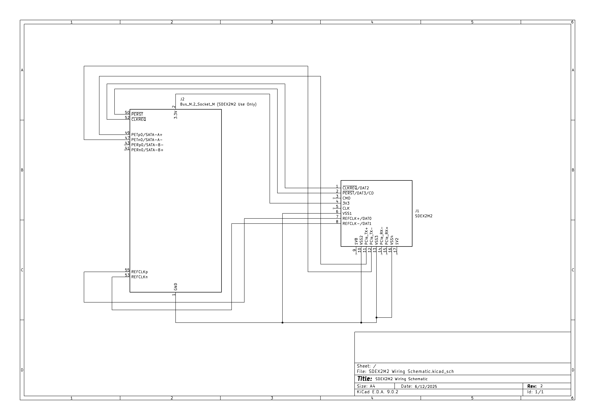

# NVNT's SDEX2M2 (MicroSD Express to M.2) Adapter Project

> Adapter for using M.2 2230 NVMe SSDs in the Nintendo Switch 2 via the MicroSD Express port.

---

## 📚 Table of Contents
- Introduction
  - [Goals](#goals)
  - [Status](#status)
  - [Warnings](#warnings)
- Assets & Hardware Info
  - [Bill of Materials (BOM)](#bill-of-materials-bom)
  - [PINOUT & LEGEND](#pinout--legend)
    - [MicroSD Express ➝ M.2 NVMe Mapping](#microsd-express--m2-nvme-mapping)
    - [M.2 NVMe Pin Definitions](#m2-nvme-pin-definitions)
    - [MicroSD Express Pin Definitions](#microsd-express-pin-definitions)
  - [Wiring Schematic](#wiring-schematic)
  - [MicroSD Express Dummy Card](#wiring-schematic)

---

## How is this possible?

This is possible because the Nintendo Switch 2's MicroSD Express slot supports the SD Express 7.1 standard, which exposes a **true PCIe Gen3 x1 interface** and utilizes the **NVMe protocol** for communication.

This adapter simply maps PCIe x1 from the Switch 2’s MicroSD Express slot to a standard M.2 2230 NVMe SSD. After further research and review from users, an onboard mcu will be required for the handshake provess with the Switch 2.

Currently, a MicroSD Express breakbout is being developed to start this process.

---

## Goals

- ✅ Create Pinout & Pin Definitions (UPDATED!)
- ✅ Create Footprints for MicroSD Express
- ✅ Create Schematic for PCB layout
- ✅ Create Dummy MicroSD Express Card V2
- 🔲 Create Dummy MicroSD Express card with breakout for prototyping
- 🔲 Create routed PCB with Gerber/Drill files
- ✅ Create BOM for fabrication and sourcing
- 🔲 (Optional) Offload VDD externally for higher-power drives
- 🔲 Produce & Test

---

## Status

Work in progress.  
We are actively developing the PCB layout, and testing.

There is still the possibility that there are power-related issues (ie: power draw of M.2 drives is more than the Switch 2 can push out), but a basic level of power filtering has been added to hopefully help a connection be established.

---

## Warnings

- Use at your own risk. We are **not liable** for any damage to your drive, Switch 2, or other devices.
- Only use **low-voltage, low-power M.2 2230 NVMe drives**.
- **Do not use this in legacy MicroSD slots** (e.g., original Nintendo Switch).
- This project is for **accessibility/educational use only**.  No commercial or piracy use permitted.

---

## Bill of Materials (BOM)

| Reference | Quantity | Description                             | Part Number        | Manufacturer   |
|-----------|----------|-----------------------------------------|--------------------|----------------|
| J2        | 1        | M.2 Socket (M-Key, 2230)                | 114020             | Amphenol       |
| FB1       | 1        | Ferrite Bead 220Ω@100MHz 0603           | BLM18PG221SN1D     | Murata/OEM     |
| PCB       | 1        | 4-Layer PCB        | N/A                | Fabricated         | *              |
|*          | 1        | 10kΩ – 100kΩ Pull Up Resistor (Optional) | N/A               | *              |

The optional resistor is for the PERST# lane, may help with state when idle. Not sure if needed until prototyping commences.

---

## PINOUT & LEGEND

### MicroSD Express ➝ M.2 NVMe Mapping

| microSD Express Pin  | PCIe Function | M.2 M-Key Pin(s) | M.2 Function         |
| -------------------- | ------------- | ---------------- | -------------------- |
| 7 (Row 1)            | REFCLK+       | B10              | REFCLK+              |
| 8 (Row 1)            | REFCLK−       | B11              | REFCLK−              |
| 2 (Row 1)            | PERST#        | A11              | PERST#               |
| 1 (Row 1)            | CLKREQ#       | B8               | CLKREQ#              |
| 11 (Row 2)           | TX+           | B23              | PCIe TX+             |
| 12 (Row 2)           | TX−           | B24              | PCIe TX−             |
| 14 (Row 2)           | RX-           | A21              | PCIe RX+             |
| 15 (Row 2)           | RX+           | A22              | PCIe RX−             |
| 4 (Row 1)            | 3.3V VDD      | B2, B3, B4       | 3.3V Power           |
| 6, 10, 13, 16     | GND           | A1, A4, etc.     | Ground               |

---

### M.2 NVMe Pin Definitions

| Pin     | Name     | Function                 |
|---------|----------|--------------------------|
| A11     | PERST#   | PCIe Reset               |
| A21     | RX+      | PCIe RX+ (to host)       |
| A22     | RX−      | PCIe RX− (to host)       |
| B10     | REFCLK+  | PCIe Reference Clock +   |
| B11     | REFCLK−  | PCIe Reference Clock −   |
| B23     | TX+      | PCIe TX+ (from host)     |
| B24     | TX−      | PCIe TX− (from host)     |
| B2–B4   | 3.3V     | Power Supply             |
| A1, A4  | GND      | Ground Pins              |

---

### MicroSD Express Pin Definitions (in SD Mode &* PCIe Mode)

| Pin | Row 1 Contact | SD Mode Function | PCIe Mode Function               |
| --- | ------------- | -------------------- | ---------------------------- |
| 1   | DAT2          | Data Line 2          | CLKREQ# (Power Mgmt)         |
| 2   | DAT3 / CD     | Data Line 3 / CD     | PERST# (Reset)               |
| 3   | CMD           | Command Line         | CMD (unused in PCIe mode)    |
| 4   | VDD           | 3.3V Power           | 3.3V Power                   |
| 5   | CLK           | Clock Line           | CLK (unused in PCIe mode)    |
| 6   | VSS           | Ground               | Ground                       |
| 7   | DAT0          | Data Line 0          | REFCLK+ (PCIe Ref Clock)     |
| 8   | DAT1          | Data Line 1          | REFCLK− (PCIe Ref Clock)     |

| Pin | Row 2 Contact   | PCIe Function                 |
| --- | --------------- | ----------------------------- |
| 9   | 1V8             | 1.8 Volts                     |
| 10  | VSS2            | Ground for isolation          |
| 11  | TX+             | PCIe TX+ (Transmit)           |
| 12  | TX-             | PCIe TX+ (Transmit)           |
| 13  | VSS3            | Ground for isolation          |
| 14  | RX-             | PCIe RX- (Receive)            |
| 15  | RX+             | PCIe RX+ (Receive)            |
| 16  | VSS4            | Ground for isolation          |
| 17  | 1V2             | 1.2 Volts                     |

Please note: Row 2 is only operational in PCIe Mode. Row 2 is based on M1cha's (https://github.com/M1cha/sdexpress_pcbs) schematic.

---

### Wiring Schematic

Still a WIP. Some discrepencies exist.

---

### MicroSD Express Dummy Card

A dummy card has been created (thanks to M1cha!), for reference. Files have been attached.

---
